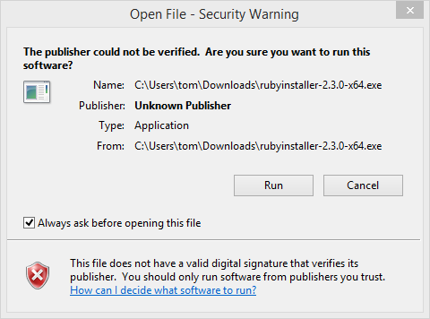
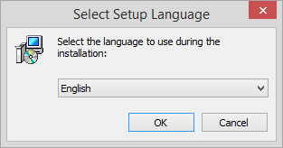
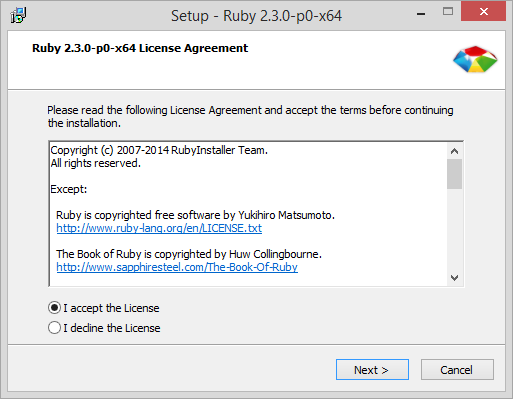
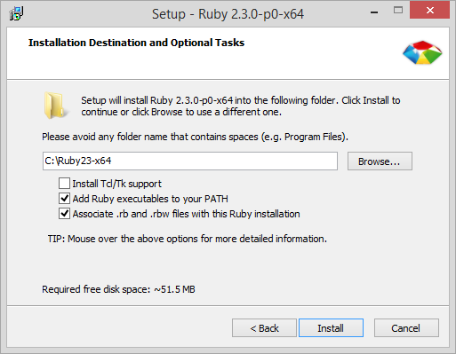
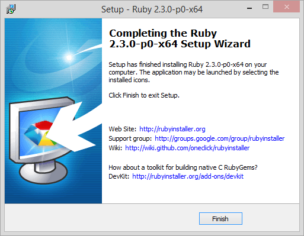

# Installing Ruby

To learn Ruby, you'll need access to a working Ruby interpreter.

## No-install method

Fortunately for you, you can try Ruby without installing anything on your computer!

From the website [Repl.it](https://repl.it/): 

> [Repl.it] is an online environment for interactively exploring programming languages.

Visit [`https://repl.it/languages/ruby`](https://repl.it/languages/ruby) to start an interactive Ruby environment, right from the comfort of your own web browser. If you create an account and sign in, you can even save your "sessions" to your account.

## Install Ruby on your own computer

Ruby runs on most operating systems. We highly recommend installing Ruby on your own computer. By doing this, you can run your code offline. Additionally, you won't need internet access to try out examples or complete your assignments!

[The official "Installing Ruby" page from `ruby-lang.org`](https://www.ruby-lang.org/en/documentation/installation/) has an extensive list of Ruby installation methods and tools.

### GNU/Linux

All worthwhile GNU/Linux distributions have an official package for Ruby. Detailed install steps:

 1. Open a terminal.
 2. Use the appropriate package manager that corresponds to your distribution.

  For Arch Linux:
  ```sh-session
  $ sudo pacman -S ruby
  ```

  For Debian / Ubuntu:
  ```sh-session
  $ sudo apt-get install ruby
  ```

  For Red Hat / Fedora / CentOS:
  ```sh-session
  $ sudo dnf install ruby
  ```

### Mac

You don't need to do anything special if you're on a Mac. Mac OS X ships with Ruby right out-of-the-box. If you want access to a newer Ruby than the pre-installed version, you can use a third-party tool like [Homebrew](http://brew.sh/) or [RVM](https://rvm.io/).

1. Install your choice of third-party tool.
2. Open a terminal.
3. Use the third-party tool:

  For Homebrew:
  ```sh-session
  $ brew install ruby
  ```

  For RVM:
  ```sh-session
  $ rvm install 2.3.1
  ```

The latest and greatest version of Ruby at this time of writing is `2.3.1`.

### Windows

[RubyInstaller](http://rubyinstaller.org/) will get you up and running if you're trying to use Ruby on the Windows operating system. After downloading the installer program, follow these instructions to get Ruby fully set up and working on your PC.

1. The installer program does not have a digital signature, so click "Run" at the security warning dialog.

  
  
2. Select your preferred language.

  

3. Accept the RubyInstaller license agreement.

  

4. Set install folder and options. Be sure to check both the "Add Ruby executables to your PATH" and "Associate .rb and .rbw files with this Ruby installation" checkboxes.

  

5. Click the "Finish" button.

  